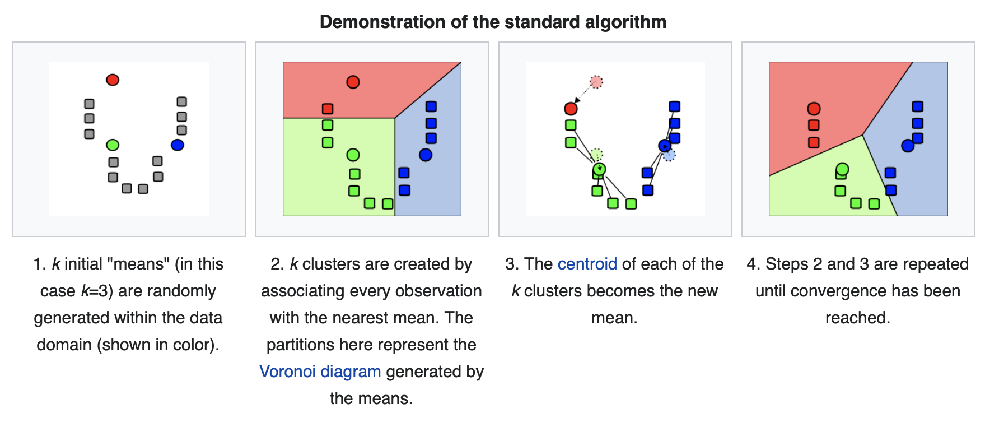
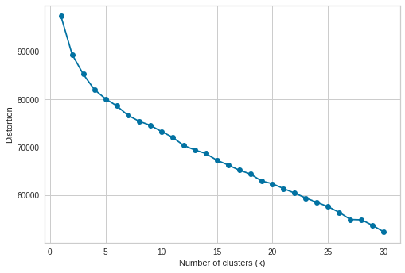
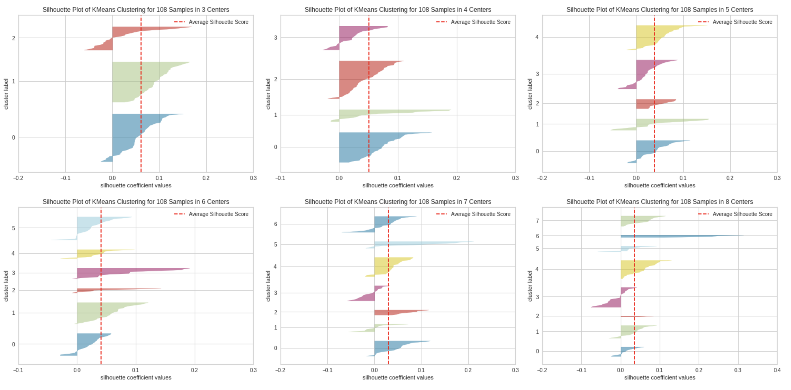

# How to build a Recommendation System in minutes?

## Abstract
KMeans is an unsupervised learning algorithm used for partitioning observations into k clusters. It's very widely used in building Recommender Systems because of it's simplicity and feasible results. We provided a very simple guide on how to include KMeans into your application to build a Recommendatino System.

## Understanding KMeans
Clustering is a computationally difficult (NP-hard) problem with heuristic based solutions to converge quickly to a local optimum. KMeans is one of the algorithms used for clustering with a very similar intuition to kNN (k-nearest neighbor classifier), a popular supervised machine learning algorithm for classification.

There are existing implementations of KMeans with the most popular being the `KMeans` class in `sklearn.cluster` module. We will start by implementing KMeans from scratch to get a better understanding of how it works under the hood. 

KMeans works by partitioning the dataset into k pre-defined clusters with each data point belonging only to a single cluster. While doing so, KMeans tries to minimize variation inside a cluster as small as possible while trying to maximize the proximity to other closters as much as possible. It selects the cluster with the closest centroid (arithmetic mean of the data points in a cluster) to the data point while assigning to a cluster, and repeates this process for all data points until it converges (next iteration of algorithm does not yield a different clustering). To avoid KMeans running for very long durations, a `max_iterations` parameter is provided to limit iterations if it does not converge.

KMeans works by following a very simple set of steps (See Figure 1. for visualization):
1. Initialize centroids by shuffling the data and randomly selecting K data points to be centroids, or randomly initializing K feature vectors on the feature space.
2. Loop steps 3-5 until it converges or `max_iterations` is reached:
3. Compute sum of squared distance between data points and all centroids.
4. Assign data point to closest cluster.
5. Computer centroids again by taking the mean of each cluster.


Fig 1. [KMeans Visualization from Wikipedia](#https://en.wikipedia.org/wiki/K-means_clustering)

```
TODO: add KMeans implementation here
```

## Building a Recommender System
For the recommendation system, we will use KMeans with a little bit of intuition. Recommendatinos are essentially information other users with similar interests know that we don't. We will use KMeans to create clusters of users with similar interests, and make our recommendations from other users interests within that cluster.

We will use the [MovieLens 100K Dataset](https://grouplens.org/datasets/movielens/) for demonstration. This is a movie ratings dataset consisting of: 943 users, 1682 items(movies), and 100000 ratings. It's very sparse in terms of ratings done by each other with respect to total movies existing in the database, which is a bit problematic for KMeans. This is a very common problem encountered while clustering data, and we will propose a very simple solution on the following parts. Dataset can be easily fetched by executing the following command:

```console
$ wget https://files.grouplens.org/datasets/movielens/ml-100k.zip && unzip ml-100k.zip
```

We already know how to implement KMeans from scratch. So, for the sake of convenience, we will use `sklearn`'s KMeans implementation for this part.

Let's start by importing dependencies.

```python
import numpy as np
import pandas as pd
import matplotlib.pyplot as plt
from sklearn.cluster import KMeans

from yellowbrick.cluster import SilhouetteVisualizer
from tqdm import tqdm # progress bar for iterations
```

We need to create a features vector for each user to cluster them by the movies they like. To achieve this, we can use each movie as a feature and the rating given to a particular movie as that feature's value. This will result in a pandas DataFrame with all movie ids as columns and user ids as indexes for each row.

Because KMeans performs very poorly with sparse datasets and ours is as sparse as it gets, we will limit the number of users and movies we'll include in our cluster. To increase density among data, we can sort the users by how many ratings they've made and only select the top 120. For the movies, we can eliminate the ones watched by less than 50 people.

```python
# read ml-100k/u.data to pandas without timestamp column, user_id as index, movie_id as columns and rating as values
ratings = pd.read_csv('ml-100k/u.data', sep='\t', header=None, usecols=[0, 1, 2], names=['user_id', 'movie_id', 'rating'])
movies = pd.read_csv('ml-100k/u.item', sep='|', header=None, usecols=[0, 1], names=['movie_id', 'movie_name'], encoding='latin-1')
users = ratings.pivot(index='user_id', columns='movie_id', values='rating').fillna(0)

# sort users by number of nonzero columns
users = users.reindex(users.astype(bool).sum(axis=1).sort_values(ascending=False).index)

# select top 120 users
users = users[:120]
print('users.shape:', users.shape)

# remove movies watched by less then 50 people
users = users.loc[:, users.astype(bool).sum(axis=0) >= 50]

# train test split 8:2
train = users.iloc[:int(users.shape[0] * 0.9), :]
print('train.shape:', train.shape)
test = users.iloc[int(users.shape[0] * 0.9):, :]
print('test.shape:', test.shape)

print('users.shape:', users.shape)
```

Out:

```
users.shape: (120, 1682)
train.shape: (108, 258)
test.shape: (12, 258)
users.shape: (120, 258)
```

Choosing the best K value is very important for the performance of our clustering. Luckily there are a few ways to determine the optimal K value. 

First one of them is the 'Elbow Method'. It's basically done by computing the total distortions for a range of K values tested, and graphing the results. From the distortions graph, the elbow is selected as the optimal value. For Figure 2 below, the elbow is around 5.

```python
# elbow method to find the optimal k
distortions = []
for i in tqdm(range(1, 31)):
    km = KMeans(n_clusters=i, init='k-means++', n_init=10, max_iter=300, random_state=0)
    km.fit(train)
    distortions.append(km.inertia_)


plt.plot(range(1, 31), distortions, marker='o')
plt.xlabel('Number of clusters (k)')
plt.ylabel('Distortion')
plt.show()
```

Out:



Figure 2. Distortions/K graph for elbow method

Using the elbow method alone is not correct for some cases, therefore we will also be using the silhouette method to verify our assumptions from the elbow method.

The silhouette plot displays a measure of how close each point in one cluster is to points in the neighboring clusters and thus provides a way to assess parameters like number of clusters visually. This measure has a range of [-1, 1].

Silhouette coefficients (as these values are referred to as) near +1 indicate that the sample is far away from the neighboring clusters. A value of 0 indicates that the sample is on or very close to the decision boundary between two neighboring clusters and negative values indicate that those samples might have been assigned to the wrong cluster.

Combining the Silhouette Method results from Figure 3, and Elbwo Method results from Figure 2; we can choose the K value to be 6.

```python
# silhouette method to find the optimal k
for i in range(3, 11):
    km = KMeans(n_clusters=i, init='k-means++', n_init=10, max_iter=300, random_state=0)
    visualizer = SilhouetteVisualizer(km, colors='yellowbrick')
    visualizer.fit(train)
    visualizer.show()
```

Out:



Fig 3. Silhouette Graphs for K3-8.

We have our KMeans model constructed with K=6, and we need to make recommendations. For this, we will determine the cluster input user belongs to, and find the highest rated movies inside that cluster that the user hasn't watched. 

```python
# construct kmeans with k=6
km = KMeans(n_clusters=6, init='k-means++', n_init=10, max_iter=300, random_state=0)

# fit kmeans
km.fit(train)

def get_recommendations(user):
    # find the cluster user belongs to
    cluster_id = km.predict(user.to_numpy().reshape(1, -1))
    cluster = train[km.labels_ == cluster_id]

    # find columns with zero values in user_id row
    unrated_movies = train.columns[user == 0]

    # find highest rated movies in cluster that user_id has not rated
    recommendations = cluster[unrated_movies].mean().sort_values(ascending=False).head(10)
    recommendations = movies.iloc[recommendations.index]['movie_name'].to_list()
    return recommendations

recommendations = get_recommendations(test.iloc[0])
print(*recommendations, sep = "\n")
```

Out:

```
Recommendations for user 345:
2001: A Space Odyssey (1968)
Restoration (1995)
Maltese Falcon, The (1941)
Leaving Las Vegas (1995)
Blues Brothers, The (1980)
It Happened One Night (1934)
Monty Python's Life of Brian (1979)
This Is Spinal Tap (1984)
Kama Sutra: A Tale of Love (1996)
Dead Man Walking (1995)
```

## References

1. Wikipedia. 'k-means clustering', https://en.wikipedia.org/wiki/K-means_clustering (Accessed: 6.01.2023)
2. Scikit-learn 'sklearn.cluster.kmeans', https://scikit-learn.org/stable/modules/generated/sklearn.cluster.KMeans.html (Accessed: 6.01.2023)
3. Scikit-learn 'Selecting the number of clusters with silhouette analysis on KMeans clustering', https://scikit-learn.org/stable/auto_examples/cluster/plot_kmeans_silhouette_analysis.html (Accessed: 6.01.2023)
4. Roman Victor. 'Unsupervised Classification Project: Building a Movie Recommender with Clustering Analysis and K-Means', Towards Data Science, https://towardsdatascience.com/unsupervised-classification-project-building-a-movie-recommender-with-clustering-analysis-and-4bab0738efe6 (Accessed: 6.01.2023)
